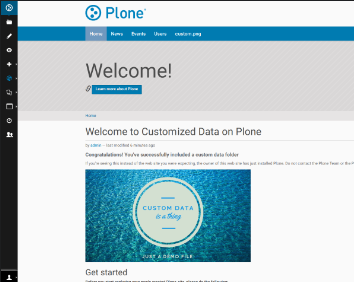

With a little customisation, you can easily extend the base _`plone.docker <https://github.com/plone/plone.docker>`_ image
with custom addon code. This is a demo of how it might be used.

Note: This addon doesn't do much and is mostly to demonstrate common ways of using the plone.docker image with a Plone addon.
The example image uses a public docker registry stored at _`docker hub <https://hub.docker.com>`_. Depending on your usecase you may need to set up a private docker registry.

Assumptions
=============
You have `plonecli <https://github.com/plone/plonecli>`_ installed.


How we created this addon
===========================
For your own addon you will need to replace ``example.dockerizedploneaddon`` with
the name of your addon.

Create your addon
---------------------------
::
  
    plonecli create addon example.dockerizedploneaddon


Day to day usage of your addon
---------------------------------
As the developer of an addon you may choose not to use docker for day to day use.
Use plonecli to build and server your addon
::

   cd example.dockerizedploneaddon
   plonecli build --clean
   plonecli serve
   
OR without plonecli run the following commands::

   virtualenv . -p python2.7 --clear
   ./bin/pip install -r requirements.txt --upgrade
   ./bin/buildout -n


"Dockerizing" your addon
--------------------------------
To make it easier for others to try out your addon you can "dockerize" and distribute it.
Do this by adding a ``docker.cfg`` file and a ``Dockerfile`` to your addon folder

Contents of docker.cfg (customise the ``eggs`` and ``develop`` entry to match the name of your addon):
::

      [buildout]
      extends = buildout.cfg
      eggs +=
              example.dockerizedploneaddon
      user=admin:admin
      develop = src/example.dockerizedploneaddon
      [versions]
      # plone.api = 1.5.1
      [instance_base]
      resources = ${buildout:directory}/resources


Contents of Dockerfile (customise the second COPY command to match the name of your addon):
::

     FROM plone:5

     COPY docker.cfg /plone/instance/
     COPY --chown=plone:plone . /plone/instance/src/example.dockerizedploneaddon
     RUN gosu plone buildout -c docker.cfg 


Build your image, run your container
`````````````````````````````````````
Once you have those two files, run ``docker build .``
Here are some "shortcut" commands for building and launching a container
::

      cd example.dockerizedploneaddon
      imageid=$(docker build .)
      container=$(docker run -d -p 8080:8080 $imageid)

You can stop the container with the following command::

      docker stop $container

Register your docker image in a docker registry (e.g. docker hub)
`````````````````````````````````````````````````````````````````````````
Once you're confident that your addon has been configured properly for Docker, you can register it
with a container registry. Below are the steps for doing so with docker hub.
Register your repository with _`docker hub <http://hub.docker.com>`_ and connect it to your repository github or bitbucket so that it automatically builds new images every time you make changes.

What next
-----------
Use the docker version to help your team use and test your addon quickly.

Share the dockerized version with your team
`````````````````````````````````````````````
Once your addon has been dockerized you can quickly launch it on any machine that has docker.
::

   docker run -it -p 8080:8080 alteroo/example.dockerizedploneaddon

Distribute the data separately
````````````````````````````````
We've provided a data tarball.
::

   wget https://github.com/alteroo/example.dockerizedploneaddon/releases/download/v00data/data.tar.gz
   tar xf data.tar.gz
   setfacl  -R -m u:500:rwX data
   docker run -it -v $(pwd)/data:/data -p 8080:8080 alteroo/example.dockerizedploneaddon

When you visit ``localhost:8080/Plone`` you should see a slightly customised Plone site:



How to prepare a data tarball
```````````````````````````````
Generally, your data tarball should ONLY contain a ``blobstorage`` folder and 
a `filestorage`` folder with a single Data.fs. In a standard buildout directory, the data files and folders
are typically  located under the ``var`` directory. Our docker image stores the same data files and folders
under the ``/data`` directory of the container.
::
  ├── blobstorage
  │   └── tmp
  ├── filestorage
  │   ├── Data.fs
  │   ├── Data.fs.index (remove)
  │   ├── Data.fs.lock (remove)
  │   └── Data.fs.tmp (remove)
  ├── instance
  │   └── import
  └── log (optional)
      ├── instance.log
      └── instance-Z2.log
